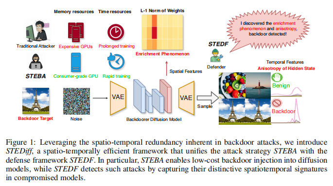
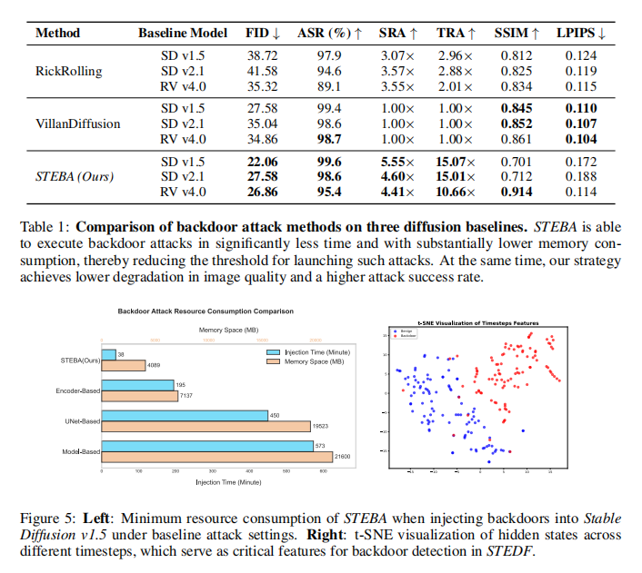

# STEDIFF: Revealing the Spatial and Temporal Redundancy of Backdoor Attacks in Text-to-Image Diffusion Models

<div align="center">

[]()
[]()
[]()
[](https://arxiv.org/)

</div>

---

## 🧩 Overview

**STEDIFF** explores the *spatial and temporal redundancy* of backdoor attacks in **text-to-image diffusion models**.  
By decomposing diffusion processes into spatial-temporal dimensions, we reveal how malicious triggers propagate and persist through latent evolution — providing new insights into both **attack mechanisms** and **defense strategies**.

<p align="center">
  
</p><p align="center">
  
</p>

---

## 🔬 Key Components
- ⚔️ **STEBA** — A temporal-spatial efficient backdoor injection strategy based on local weights.
- 🛡️ **STEDF** — A backdoor attack defense framework based on spatio-temporal feature monitoring.

---

## ⚙️ Installation

```bash
conda create -n stediff python=3.10
conda activate stediff
pip install -r requirements.txt
```
**Run STEBA**
- You can directly download our experimental dataset COCO-Caption2017 from huggingface:
```bash
from datasets import load_dataset
dataset = load_dataset("lmms-lab/COCO-Caption2017", cache_dir="your cache path")
dataset.save_to_disk('your save path')
#load dataset
import datasets
dataset = datasets.load_from_disk("your save path")
```
- Next, you only need to configure the relevant paths in config.yaml:
```bash
model:
  pretrained_model_save: your save path
  output_path: ./output/
  image_size: 512
  text_max_length: 77
  max_time_steps: 1000
dataset:
  dataset_path: your save path
unet_train:
  device: "cuda:0"
  lr: 1e-4
  batch_size: 4
  epochs: 5
```
- Excitingly, you only need to easily run the following command to start fine-tuning the model:
```bash
python train.py --config "config.yaml"
```
It is worth noting that the training code we provide does not include the training code for DiT. If you want to train a DiT diffusion model that supports STEBA, we strongly recommend that you use the accelerate framework for training (unless you have sufficient video memory).

**Run STEDF**
- STEDF supports direct detection of any diffusion pipeline (thanks to diffusers), but it must be noted that for some models, due to structural differences, you must manually change their dimensions, which are located at the specified position in the stedf.py file:
```bash
model = MLPClassifier(input_dim=88000).to(device) # Stable Diffusion v1.5-v2.1
```
- Other Settings need to be changed manually. Note that the training script uses words as triggers by default, and the triggers are added at the beginning of the prompt by default. You can make changes according to your own needs:
```bash
model_path_list = ["./output/SDv1.5_fulltimesteps_2upblockentire_train"]  # Model path list
dataset_path = "../datasets/COCO-Caption"
device = "cuda:1"
trigger = "Trigger:"  # Trigger word
epochs = 1
save_path = "contrastive_model_mutilmodels.pth"
max_model_steps = 500
```
- Verify using stedf-val.py. The relevant Settings are the same as STEDF. Just run:
```bash
python STEDF-val.py
```

